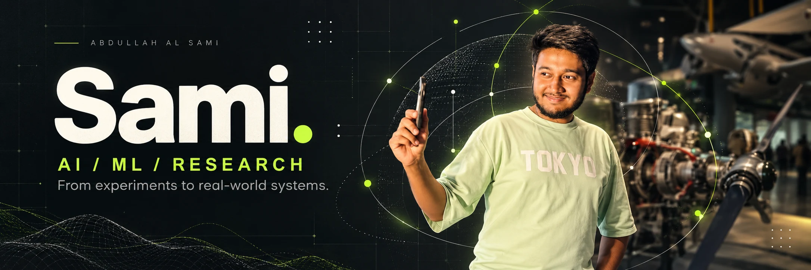
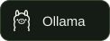
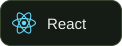
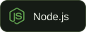

  <a href="https://github.com/XDR-SAM?tab=repositories"><b>Explore my work ↗</b></a>
  &nbsp; / &nbsp;
  <a href="https://linkedin.com/in/al-sami-io">LinkedIn</a>
  &nbsp; / &nbsp;
  <a href="mailto:tdxfarhan@gmail.com">Get in touch</a>

# Research-minded. Product-driven.

I'm **Abdullah Al Sami**, a developer working across **AI, machine learning, and ML research**. I like understanding how models behave, testing ideas through experiments, and turning them into software people can use.

My work also spans **Shopify, payment integrations, business dashboards, full-stack development, and DevOps** — the interfaces, services, and infrastructure that turn an idea into a working system.

**Currently focused on →** ML reliability and evaluation, language models, AI tooling, and practical AI applications.

 

## Live / The work, in motion

<picture>
  <source media="(prefers-color-scheme: dark) and (max-width: 600px)" srcset="assets/live/stats-dark-mobile.svg">
  <source media="(max-width: 600px)" srcset="assets/live/stats-light-mobile.svg">
  <source media="(prefers-color-scheme: dark)" srcset="assets/live/stats-dark.svg">
  
</picture>

<picture>
  <source media="(prefers-color-scheme: dark)" srcset="assets/live/snake-dark.svg">
  
</picture>

Refreshes every six hours via GitHub Actions. Activity covers the rolling contribution year; longest streak is within that window. Current streak uses UTC and allows today to be unfinished.

<b>Explore the numbers & refresh status ↗</b>

[Contribution history](https://github.com/XDR-SAM?tab=overview) · [Recent public activity](https://github.com/XDR-SAM?tab=activity) · [Refresh workflow](https://github.com/XDR-SAM/XDR-SAM/actions/workflows/profile.yml)

Counts reflect what GitHub exposes to the workflow token. Commit contributions follow GitHub's contribution rules; they are not a count of every commit on every branch. Languages measure code bytes in the 30 most recently pushed public, non-fork, non-archived repositories, excluding this profile. They do not measure proficiency or time spent coding.

 

## 01 / Areas of focus

<table>
<tr>
<td width="50%" valign="top">

### 🧠 AI & machine learning

Language models, AI applications, model routing, and experiments that connect intelligent systems to useful interfaces.

**Explore → prototype → integrate**

</td>
<td width="50%" valign="top">

### 🔬 ML research

Model evaluation, confidence, temporal shift, and reproducible experiments. Clear questions, explicit limitations, and evidence before claims.

**Hypothesize → measure → iterate**

</td>
</tr>
<tr>
<td width="50%" valign="top">

### ◈ Commerce & products

Shopify storefronts, payment workflows, operational dashboards, and full-stack applications built around real business needs.

**Design → build → ship**

</td>
<td width="50%" valign="top">

### ⚙ Infrastructure & DevOps

Cloud services, containers, deployment pipelines, and the backend systems that keep applications running.

**Deploy → observe → improve**

</td>
</tr>
</table>

 

## 02 / Fresh from the workspace

<!-- LATEST-PROJECTS:START -->
| Recently pushed project | Language | Last push (UTC) |
| :--- | :--- | :--- |
| **[LPG-Distribution-Management](https://github.com/XDR-SAM/LPG-Distribution-Management)** LPG Distribution Management is a complete business management system designed for LPG distributors, godown owners, and wholesale suppliers in Bangladesh. It … | TypeScript | 2026-10-04 |
| **[Typed-decision-reliability-Research-Study](https://github.com/XDR-SAM/Typed-decision-reliability-Research-Study)** Explore the repository for project details. | HTML | 2026-10-03 |
| **[bifrost-model-router](https://github.com/XDR-SAM/bifrost-model-router)** Bifrost model router - Codex routing and model catalog management | Go | 2026-09-24 |
| **[fashion-mnist-DEEP-LEARNING](https://github.com/XDR-SAM/fashion-mnist-DEEP-LEARNING)** Explore the repository for project details. | — | 2026-08-28 |
| **[usb-shield](https://github.com/XDR-SAM/usb-shield)** Explore the repository for project details. | HTML | 2026-08-24 |
| **[Onehealth-Agent-Brain-Router](https://github.com/XDR-SAM/Onehealth-Agent-Brain-Router)** Explore the repository for project details. | TypeScript | 2026-08-22 |

Updated 2026-10-07 23:04 UTC · Public, non-fork, non-archived repos, sorted by latest push. Automated pushes can also appear.
<!-- LATEST-PROJECTS:END -->

<b>Open the curated project showcase ↗</b>

A few public projects that connect my research interests with what I build.

| Project | What I'm exploring or building |
| :--- | :--- |
| **[Typed Decision Reliability ↗](https://github.com/XDR-SAM/Typed-decision-reliability-Research-Study)** ML RESEARCH | A feasibility pilot studying confidence gates under temporal shift, using chronological splits, TF-IDF, and logistic regression. Includes evaluation, audits, and a protocol for the next stage. |
| **[TinyGPT ↗](https://github.com/XDR-SAM/tinygpt)** DEEP LEARNING | A small character-level transformer trained on Shakespeare, with CPU training and CLI/web generation. A hands-on exploration of language modeling. |
| **[Bifrost Model Router ↗](https://github.com/XDR-SAM/bifrost-model-router)** AI INFRASTRUCTURE | A model-routing layer that connects provider catalogs and API formats, with Docker-based setup and route-aware credential handling. |
| **[ESP32 LLM Gateway ↗](https://github.com/XDR-SAM/ESP32-LLM-Gateway)** AI × HARDWARE | An ESP32-S3 gateway with a Cloudflare Worker, an outbound WebSocket tunnel, and an OpenAI-compatible API. |
| **[Newmrkt Shopify Theme ↗](https://github.com/XDR-SAM/newmrkt-howaizen-theme)** COMMERCE | A Shopify Horizon theme export for the Newmrkt storefront — part of my work on commerce experiences. |
| **[LPG Distribution Management ↗](https://github.com/XDR-SAM/LPG-Distribution-Management)** BUSINESS SOFTWARE | A distribution management application covering inventory, billing, payments, accounts, and reporting, with an AI operations assistant. |

<a href="https://github.com/XDR-SAM?tab=repositories"><b>More experiments, tools, and applications ↗</b></a>

 

## 03 / My working toolkit

### AI & machine learning

  
  
  
  

### Model ecosystem I explore

  
  
  
  
  
  

### Full-stack & data

  
  
  
  
  
  
  

### Commerce & payments

  
  
  

### Cloud & delivery

  
  
  
  
  
  

<b>Most used languages ↗</b>

<picture>
  <source media="(prefers-color-scheme: dark)" srcset="assets/live/languages-dark.svg">
  
</picture>

 

## 04 / How I approach the work

<picture>
  <source media="(prefers-color-scheme: dark) and (max-width: 600px)" srcset="assets/process-dark-mobile.svg">
  <source media="(max-width: 600px)" srcset="assets/process-light-mobile.svg">
  <source media="(prefers-color-scheme: dark)" srcset="assets/process-dark.svg">
  
</picture>

- **Start with a question.** Define the problem and what a useful result would look like.
- **Make the experiment honest.** Establish baselines, inspect failures, and document limitations.
- **Connect research to a product.** Give ideas an interface, a workflow, and a path to deployment.
- **Think beyond the demo.** Consider maintainability, observability, and the people using it.

 

---

### A good question is a great place to start.

I'm interested in conversations about **AI/ML research, intelligent products, Shopify, and the systems that make software useful.**

**[Let's connect on LinkedIn ↗](https://linkedin.com/in/al-sami-io)** &nbsp; · &nbsp; **[Send me an email ↗](mailto:tdxfarhan@gmail.com)**

Abdullah Al Sami &nbsp; / &nbsp; XDR-SAM &nbsp; / &nbsp; Always experimenting.

