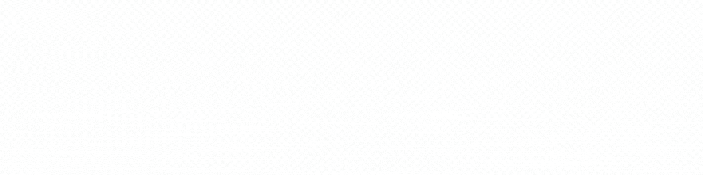

# 👋 Hey there, I'm Abdullah Al Sami

### 🔥 Full Stack Developer & Creative Technologist

---

  

### ✨ What I'm Working On

---

## 🚀 Tech Stack

### 💻 Frontend Development

  
  
  
  
  
  

### ⚙️ Backend Development

  
  
  
  

### 🛠️ Tools & Technologies

  
  
  
  
  
  

### 🎨 Design & Others

  
  
  

---

## 📈 GitHub Stats

| 🔥 Streak | 📊 Stats | 🏆 Top Languages |
|:---------:|:--------:|:----------------:|
|  |  |  |

---

## 🌐 Connect With Me

  
  
  
  

---

### 💬 Let's Collaborate!

  I'm always excited to work on new projects and explore innovative ideas. 
  Feel free to reach out if you want to build something amazing together!

⭐️ From [Abdullah Al Sami](https://github.com/xdr-sam)

